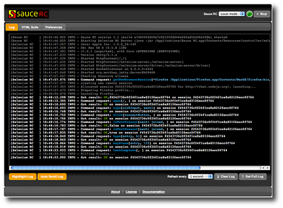
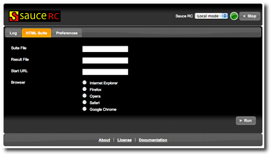
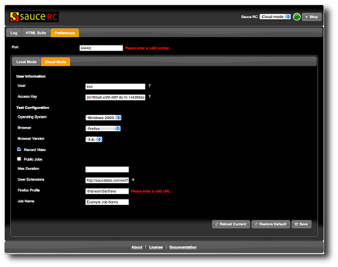
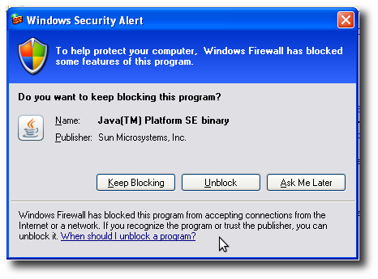

Sauce RC Documentation
======================

What is Sauce RC?
-----------------
Sauce RC is the Sauce Labs Selenium RC distribution. Our main
motivation for creating Sauce RC is that some users found it
time-consuming or confusing to install and use a command line
Java application that was just delivered in a zip file.

Because of this, we made Sauce RC as user-friendly as we could.  We
provide a graphical installer, so that getting started is as easy as
downloading and clicking through a few dialog boxes. In only a few
simple steps, Sauce RC gives you a complete set up to start running
Selenium tests.

Installing Sauce RC
-------------------
To get started, just `download Sauce RC's installer`_ and run it. The installer
will check your machine for dependencies (such as Java) and will start the
installation once the prerequisites are in place.

You can optionally place a Sauce RC launcher icon on your Desktop or
the quick launch bar, and you can choose whether to run the program
after the installation has finished.

Using Sauce RC
--------------
Our main concern was to make Selenium easier to use.  The first step was to
make it possible to use Sauce RC without working with a command line.  With
Sauce RC, you can configure, start and stop Selenium from a graphical user
interface or even your system tray.

To start or stop Sauce RC from the system tray, just right click on the icon.
To work with the GUI, just click on the system tray or open
http://localhost:8421 in your browser.

.. Note:: As Sauce RC's GUI is web based, it can be accessed from any computer
  within the same network, just point your browser to the ip in which Sauce RC is
  running.

Sauce RC execution modes
------------------------
The new Sauce RC has two execution modes:

* Local Mode: This mode will run your tests locally against the browsers you
  have installed on this machine. Sauce RC will take care of setting up clean
  profiles and managing browsers for you, so you can get more testing done.
* Cloud Mode: `Sauce OnDemand`_ runs your tests in our own servers so you don't
  have to keep up with the latest browsers, deal with configuring multiple test
  machines, and to the tough effort of testing your application.  Sauce
  OnDemand also records a video of every test so you can see exactly what went
  wrong once it's finished.

Using Sauce RC in its cloud mode
~~~~~~~~~~~~~~~~~~~~~~~~~~~~~~~~~~~
This mode allows you to run your tests in any of the OS/browser combinations
under `Sauce OnDemand`_ without making any kind of change in the tests. To use
this mode, you will first need to `signup for an account`_ and get some test
minutes, either by subscribing with a Credit Card or by buying some pre-paid
minutes with a PayPal account.

Running Selenese tests with the new HTML Suite tab
--------------------------------------------------
For compatibility with `Selenium RC's htmlSuite mode`_, Sauce RC also includes
an HTML Suite tab, which gives the users the possibility to run `Selenese`_
tests using Sauce RC.

Just set all the required fields and press the "Run" button on the bottom right
for the suite to start.  Sauce RC will run the whole test suite locally and
notify any other users though the web interface that a suite is being ran. Any
user has still the possibility to kill Sauce RC while the test is running, so
be careful.

.. Note:: For Sauce RC to be able to find and run a Selenese html test, the
  suite html file and the tests must be available in the same computer in which
  Sauce RC is running. If you're accessing the web interface from a remote
  computer, you should first copy those files to the machine.

Configuring Sauce RC
--------------------
The new Sauce RC has a web interface from which you can Start, Stop and
configure both local and cloud execution modes.  Every parameter or option
available for both Selenium RC and Sauce OnDemand is configurable from Sauce
RC's GUI, with real time validations and is remembered after restarting.

We think the use is pretty straightforward, but please let us know if you think
something should be documented.

Where are the config files located
~~~~~~~~~~~~~~~~~~~~~~~~~~~~~~~~~~
If you want to edit the config or log files by hand, or transfer them
between computers, you can find them on windows in the following paths::

    %APPDATA%\Sauce RC\config.json
    %APPDATA%\Sauce RC\saucerc.log

For mac they are kept in::

    ~/.saucerc/config.json
    ~/.saucerc/saucerc.log

Troubleshooting
---------------
Sauce RC is refusing to start
~~~~~~~~~~~~~~~~~~~~~~~~~~~~~
Sauce RC could be finding the port closed, which prevents Selenium RC
from starting. Try changing the port from the configuration and then
starting the server again from our tray icon.

Another option is that the configuration file somehow got corrupted. In that
case copy the default configuration from 
`C:\\Program Files\\Sauce Labs\\Sauce RC\\config.json` to 
`%APPDATA%\\SauceRC\\config.json` (these instructions are for windows).

Where is the log for a previous test run?
~~~~~~~~~~~~~~~~~~~~~~~~~~~~~~~~~~~~~~~~~
The logs are appended one after another. Once the log file reaches
2MB, it will start removing the oldest log lines from the beginning of
the file as new lines are added to the end.

I get a "Windows Security Alert" when running Sauce RC
~~~~~~~~~~~~~~~~~~~~~~~~~~~~~~~~~~~~~~~~~~~~~~~~~~~~~~
Sometimes, you will need to tell windows to allow Sauce RC to run.

If you see something like:

when running Sauce RC, you need to click "Unblock" to allow Sauce RC to work.

Coming in future releases
-------------------------
We have a lot of ideas in which we're currently working on, so expect
new releases regularly.

Do you feel there's something we should add to Selenium? Is there a
new feature you'd be excited to see? Please let us know! We have an
`idea box`_ on our website, and we'd love to hear from you.

.. _`Selenium RC's htmlSuite mode`: http://seleniumhq.org/docs/05_selenium_rc.html#run-selenese-directly-within-the-server-using-htmlsuite
.. _`Selenese`: http://seleniumhq.org/docs/04_selenese_commands.html
.. _`Sauce OnDemand`: http://saucelabs.com/ondemand
.. _`execution mode`: `Sauce RC execution modes`_
.. _`download Sauce RC's installer`: http://saucelabs.com/products/downloads
.. _`idea box`: http://feedback.saucelabs.com
.. _`signup for an account`: http://saucelabs.com/products/docs/sauce-ondemand#getting-started
